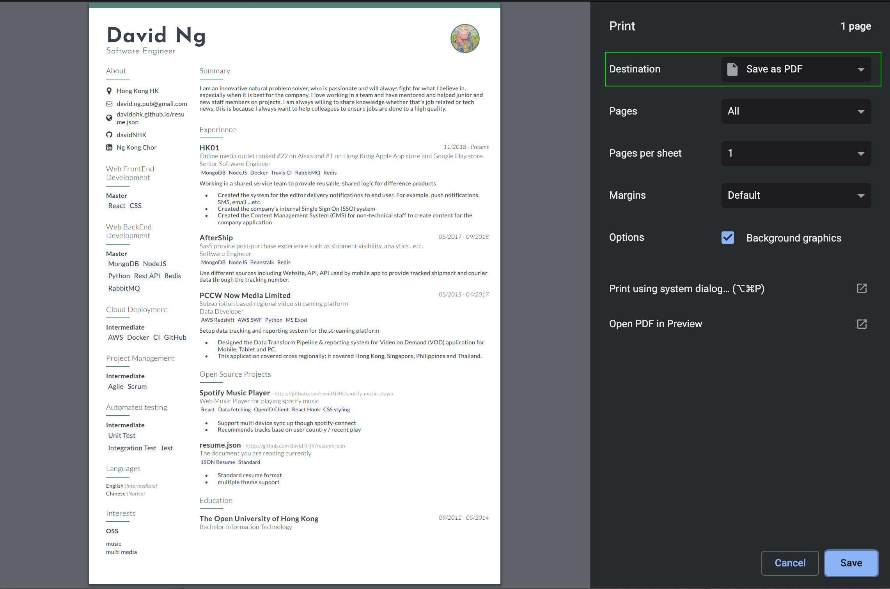

# resume.json

[](https://github.com/davidNHK/resume.json/actions/workflows/deploy-gh-page.yml)

Repo here contain my personal resume.

Development
```
yarn
yarn dev
```

[Live version](https://davidnhk.github.io/resume.json/)


# Get PDF Version

Access [Live version](https://davidnhk.github.io/resume.json/) 
on Browser and click print (Command + P) in toolbar then select `Save as PDF`. 

